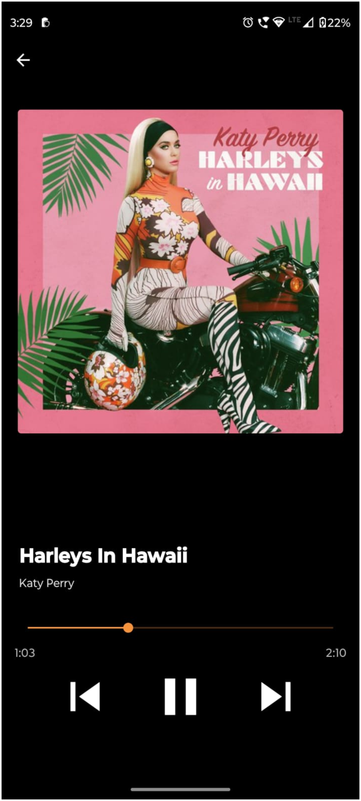

# Introduction

VIBIEE is a sleek and modern music player application built using React Native. It offers a responsive design that enhances the music listening experience on mobile devices. Whether you're commuting, working out, or simply relaxing, VIBIEE provides a seamless way to enjoy your favorite tunes.



# Installation

To run this project on your local environment, you need to have Android Studio setup in your environment

- Clone this project 
```bash
  cd my-project
```

- Install node modeules

```bash
  npm i
```
- Then run the metro with the following command for Android

```bash
  npx react-native run-android
```
- Command for IOS

```bash
  npx react-native run-ios
```
# Lessons Learned

Learned alot of crucial stuffs while developing VIBIEE. Over all it was a great experience as it was my most complex application development till date. Things that developing VIBIEE made me learned are :-

- Learned about a great npm package that is "React-Native Track Player", which is basically an package that provides alot features to built an music player service.

- Learned about "React-Navigation" which is also and npm package that is used for switching/navigation between several screens.

- Learned and got a good experience about react-hooks like useState and UseEffect.

- Learned to manage good amount of data assets in local.

- Learned to set application icon.

